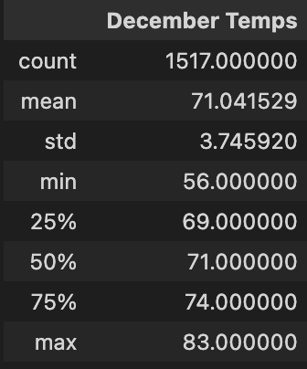

# Surfs Up

## Overview of Analysis
---

The goal of this analysis is to create a basic statistical analysis of the temperatures on Oahu during the months of June and December. This is to help determine whether or not the surf and ice cream shop business is sustainable year-round. By creating a query that captures the temperatures specifically for the months of June and December, we can retrieve information such as average, maximum, and minimum temperatures.

## Results
---

#### June Temperature Analysis

Based on our analysis, we know that there are 1,700 observations in June. This covers the years 2010 to 2017. The average, minimum, and maximum temperatures are shown below. A low standard deviation means that the spread of all temperature observations is relatively small. This makes sense since the weather on Oahu doesn't seem to fluctuate much.

#### December Temperature Analysis

On the other hand, December seems to have been observed only 1,517 times. This indicates that temperature records are missing for some dates. However, this already has a large sample size, which makes the analysis relatively representative. From the graph, you can see that the average, maximum, and minimum temperatures for June and December are close to each other. More importantly, the spread is nearly identical to his June spread.

## Summary
---

Comparing the two-month statistical summaries, we can conclude that the temperature pattern is constant throughout the year. However,  to better understand the weather in Oahu, he should include two additional queries. Temperatures can stay roughly the same throughout the year, but rainfall doesn't have a significant impact on the company's sustainability. Statistical summaries of precipitation patterns for June and December provide a better understanding of overall weather patterns.

Another query you can create to aid further analysis is comparing the most active station's weather patterns. This helps narrow down the best locations by showing you the most popular stations combined with the most stable weather patterns.
